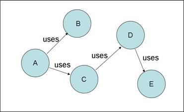

# Mock 简介

Mock 测试是单元测试的重要方法之一

## 什么是 Mock 测试

Mock 测试就是在测试过程中，对于某些不容易构造（如 HttpServletRequest 必须在Servlet 容器中才能构造出来）或者不容易获取比较复杂的对象（如 JDBC 中的 ResultSet 对象），用一个虚拟的对象（Mock 对象）来创建以便测试的测试方法。

Mock 最大的功能是帮你把单元测试的耦合分解开，如果你的代码对另一个类或者接口有依赖，它能够帮你模拟这些依赖，并帮你验证所调用的依赖的行为。

比如一段代码有这样的依赖：

当我们需要测试A类的时候，如果没有 Mock，则我们需要把整个依赖树都构建出来，而使用 Mock 的话就可以将结构分解开，像下面这样：

## Mock 对象使用范畴

- 真实对象具有不可确定的行为，产生不可预测的效果，（如：股票行情，天气预报）
- 真实对象很难被创建的
- 真实对象的某些行为很难被触发
- 真实对象实际上还不存在的（和其他开发小组或者和新的硬件打交道）
- ...